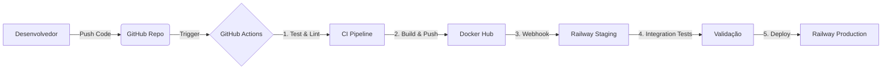

# 🤖 IsCoolGPT - Assistente Inteligente de Estudos 

O **IsCoolGPT** é uma API de Chatbot Educacional desenvolvida como Projeto Final da disciplina de Cloud Computing. O sistema utiliza Inteligência Artificial Generativa (Google Gemini) para atuar como um professor especialista, ajudando estudantes a compreenderem conceitos complexos de forma didática.

O projeto se destaca por sua esteira de **DevOps robusta**, utilizando contêineres Docker e orquestração de deploy automatizado via GitHub Actions para a plataforma Railway.

-----

## 🏗️ Arquitetura do Projeto

O sistema foi projetado seguindo práticas modernas de Cloud Native e GitOps.



### 🛠️ Tech Stack

  * **Linguagem:** Python 3.12
  * **Framework Web:** FastAPI (Alta performance e validação de dados)
  * **Gerenciador de Dependências:** `uv` (Astral) - Ultra rápido
  * **IA Generativa:** Google Gemini 2.5 Flash
  * **Containerização:** Docker
  * **CI/CD:** GitHub Actions
  * **Infraestrutura (Cloud):** Railway
  * **Qualidade de Código:** Ruff (Linter) e Pytest (Testes)

-----

## 🚀 Funcionalidades

  * **Chat Educacional:** Endpoint `/chat` que processa perguntas e retorna explicações didáticas, com analogias e exemplos práticos.
  * **Persona Definida:** O bot atua estritamente como um professor paciente e especialista.
  * **Health Check:** Endpoint raiz `/` para verificação de status do serviço.
  * **Documentação Automática:** Swagger UI disponível nativamente em `/docs`.

-----

## ⚙️ Instalação e Execução Local

### Pré-requisitos

  * Python 3.12+
  * Git
  * Chave de API do Google Gemini (`API_KEY`)

### Passos

1.  **Clone o repositório:**

    ```bash
    git clone https://github.com/carlos3du/chatbot_cloud.git
    cd chatbot_cloud
    ```

2.  **Configure as Variáveis de Ambiente:**
    Crie um arquivo `.env` na raiz do projeto:

    ```env
    API_KEY=sua_chave_do_google_gemini_aqui
    ```

3.  **Instale as dependências:**
    Recomendamos o uso do `uv` (como configurado no Dockerfile), mas você pode usar `pip`:

    ```bash
    # Opção 1: Usando pip
    pip install -r pyproject.toml

    # Opção 2: Usando uv (mais rápido)
    pip install uv
    uv sync
    ```

4.  **Execute a aplicação:**

    ```bash
    uvicorn app.main:app --reload --host 0.0.0.0 --port 8000
    ```

5.  **Acesse:**

      * API: `http://localhost:8000`
      * Documentação (Swagger): `http://localhost:8000/docs`

-----

## 🐳 Executando com Docker

Se preferir rodar a aplicação em um container isolado:

1.  **Construa a imagem:**

    ```bash
    docker build -t chatbot-cloud .
    ```

2.  **Rode o container:**

    ```bash
    docker run -p 8000:8000 --env-file .env chatbot-cloud
    ```

-----

## 🔄 Pipelines de CI/CD (GitHub Actions)

O projeto possui 4 workflows configurados para garantir a qualidade e entrega contínua:

1.  **CI Pipeline (`1_ci.yml`)**:

      * Acionado em *pushes* na branch `dev`.
      * Instala Python e dependências via `uv`.
      * Executa **Ruff** para linting e padronização de código.
      * Executa **Testes Unitários** (`tests/ci/`) com Pytest.
      * Se aprovado, cria automaticamente um PR para `staging`.

2.  **Deploy to Staging (`2_deploy_staging.yml`)**:

      * Acionado na branch `staging`.
      * Constrói a imagem Docker.
      * Executa um **Smoke Test** (roda o container e verifica se inicia corretamente).
      * Faz push da imagem para o Docker Hub (`tag: staging`).
      * Dispara Webhook para deploy no ambiente de **Staging no Railway**.

3.  **Validation & Production Merge (`3_validation_production.yml`)**:

      * Chamado automaticamente após o sucesso do deploy em Staging.
      * Executa **Testes de Integração** (`tests/integration/`) contra a URL real de Staging.
      * Verifica se a API responde corretamente a requisições externas.
      * Se aprovado, cria automaticamente um PR de `staging` para `main`.

4.  **Deploy to Production (`4_deploy_production.yml`)**:

      * Acionado na branch `main`.
      * Constrói a imagem de produção.
      * Faz push para o Docker Hub (`tag: production`).
      * Dispara Webhook para deploy no ambiente de **Produção no Railway**.

-----

## 🧪 Testes

O projeto implementa uma pirâmide de testes:

  * **Testes Unitários (`tests/ci/`):** Testam a lógica interna das rotas e do FastAPI usando `TestClient`.
  * **Testes de Integração (`tests/integration/`):** Utilizam `httpx` para fazer requisições reais contra o ambiente de Staging implantado, validando a infraestrutura e a conexão com a LLM.

Para rodar os testes localmente:

```bash
# Testes Unitários
pytest tests/ci/

# Testes de Integração (Requer STAGING_URL no .env)
pytest tests/integration/
```

-----

## 📂 Estrutura de Arquivos

```
chatbot_cloud/
├── .github/workflows/   # Pipelines de CI/CD
├── app/
│   ├── __init__.py
│   └── main.py          # Código fonte da API e lógica da LLM
├── tests/
│   ├── ci/              # Testes unitários (offline)
│   └── integration/     # Testes de integração (online)
├── .dockerignore
├── .gitignore
├── .python-version
├── Dockerfile           # Configuração da imagem (Multi-stage/System)
├── pyproject.toml       # Dependências do projeto
├── README.md
└── uv.lock              # Lockfile do gerenciador uv
```

-----

## 👨‍💻 Autor

Desenvolvido por **Carlos Eduardo** como parte da avaliação de Cloud Computing.

  * **Universidade:** CESAR School
  * **Curso:** Ciência da Computação